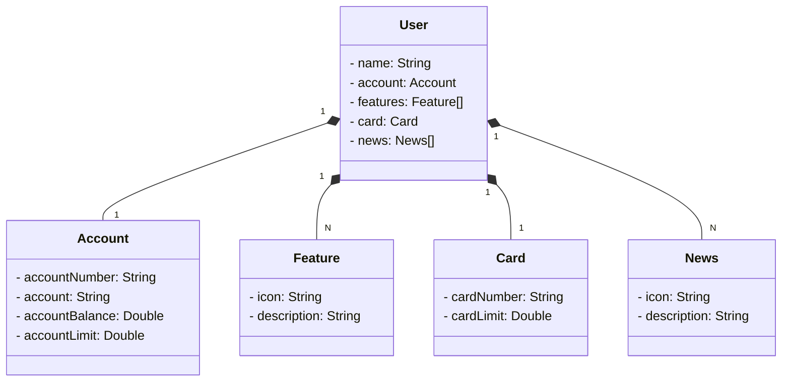

# Santander 2023
Java RESTful API criada criada para desafio de projeto do BootCamp Sandanter.

## Diagrama de Classes

```mermaid
classDiagram
  class User {
    - name: String
    - account: Account
    - features: Feature[]
    - card: Card
    - news: News[]
  }

  class Account {
    - accountNumber: String
    - account: String
    - accountBalance: Double
    - accountLimit: Double
  }

  class Feature {
    - icon: String
    - description: String
  }

  class Card {
    - cardNumber: String
    - cardLimit: Double
  }

  class News {
    - icon: String
    - description: String
  }

  User "1" *-- "1" Account
  User "1" *-- "N" Feature
  User "1" *-- "1" Card
  User "1" *-- "N" News
```
